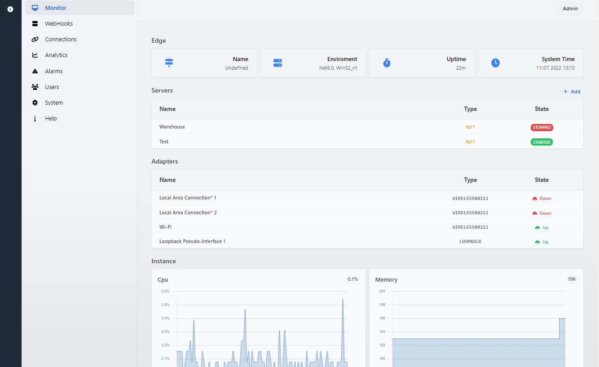
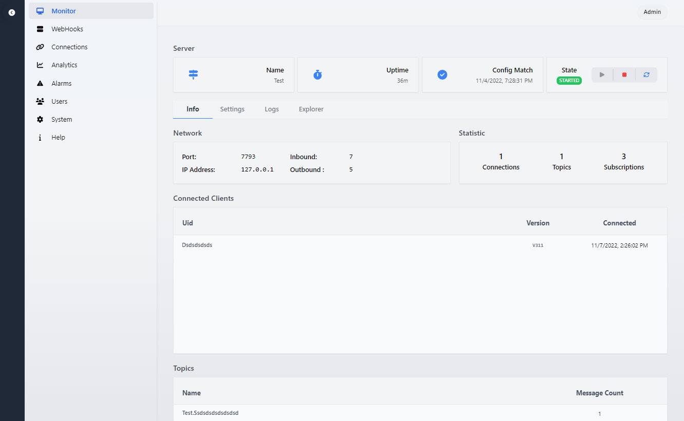
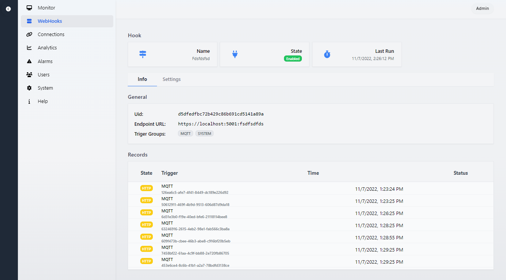
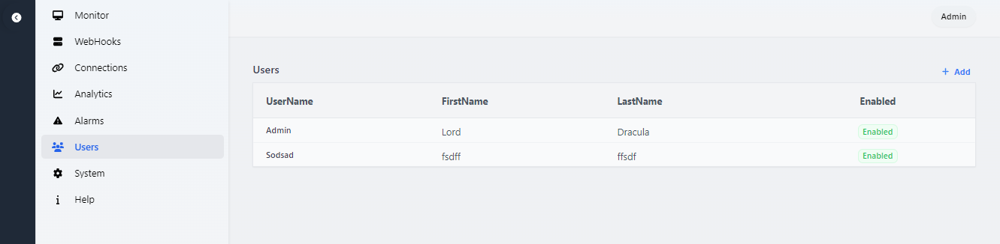
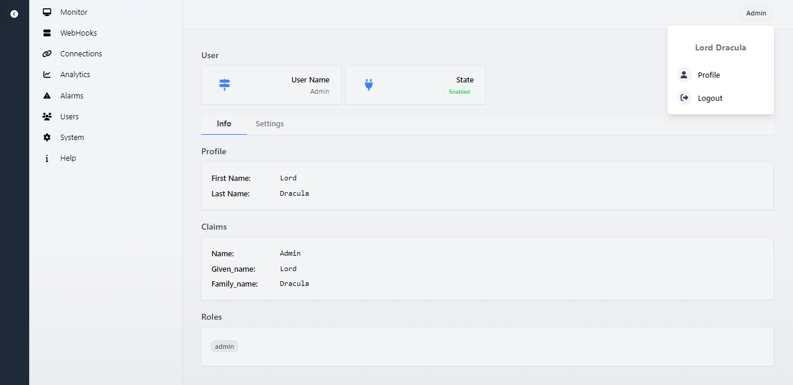

# Unified Edge

## This is early BETA!
- App is in BETA with known bugs and is not ready for production or ussage
- Many parts will get optimized and changed in time...
- Online to validate build process and pipeline

## Description

Edge Brooker allows you to communicate using different protocols with field devices and bridge between them...

**API**
- Graphql
- Rest
  
**Protocols**
- MQTT (Currently)
- OpcUA (InProgress)
- S7Comm (Planned)

**Environment:**
- Electron multiplatform app
- Self-hosted webApp

**Screens:**

