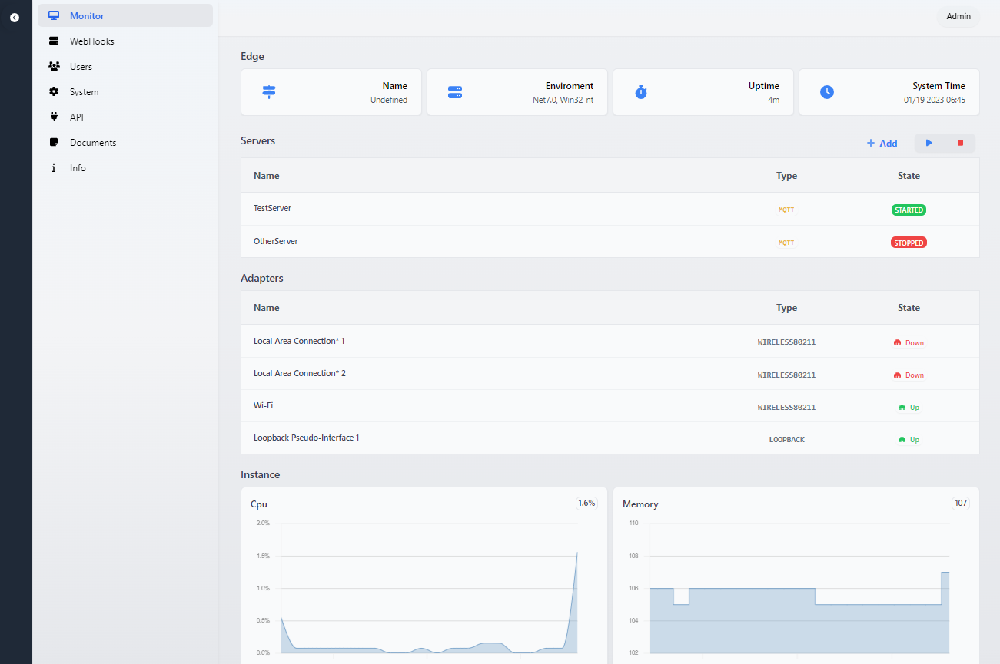
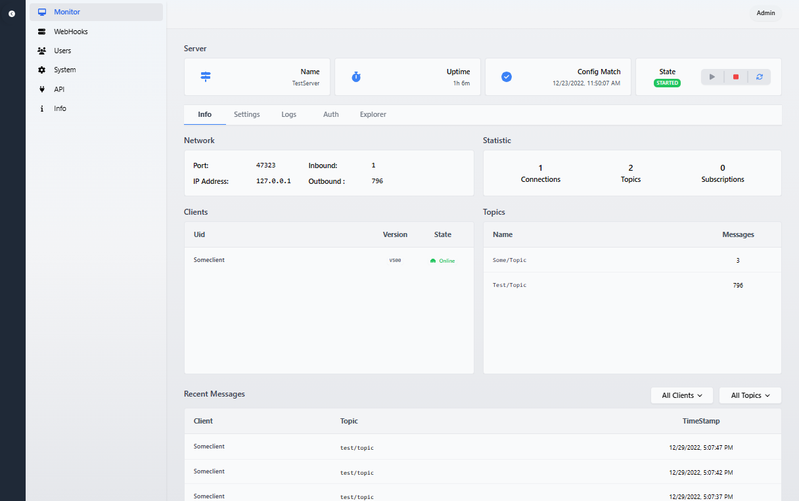
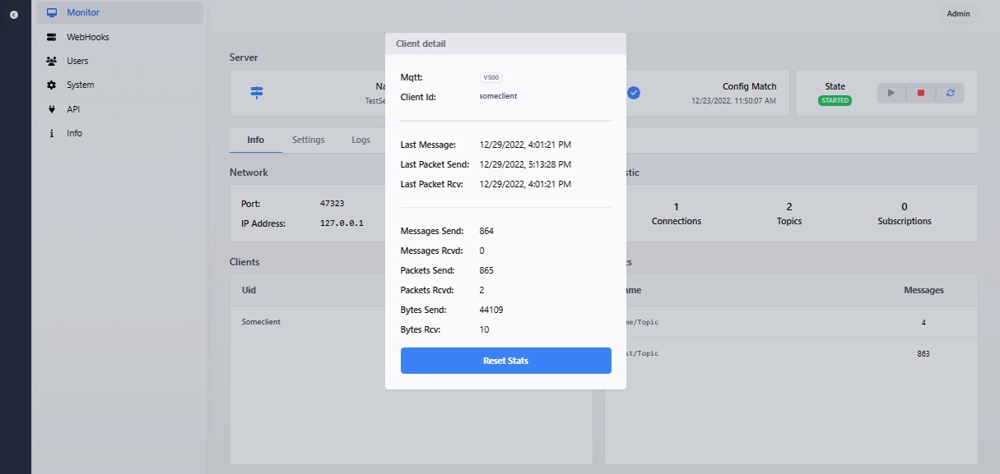
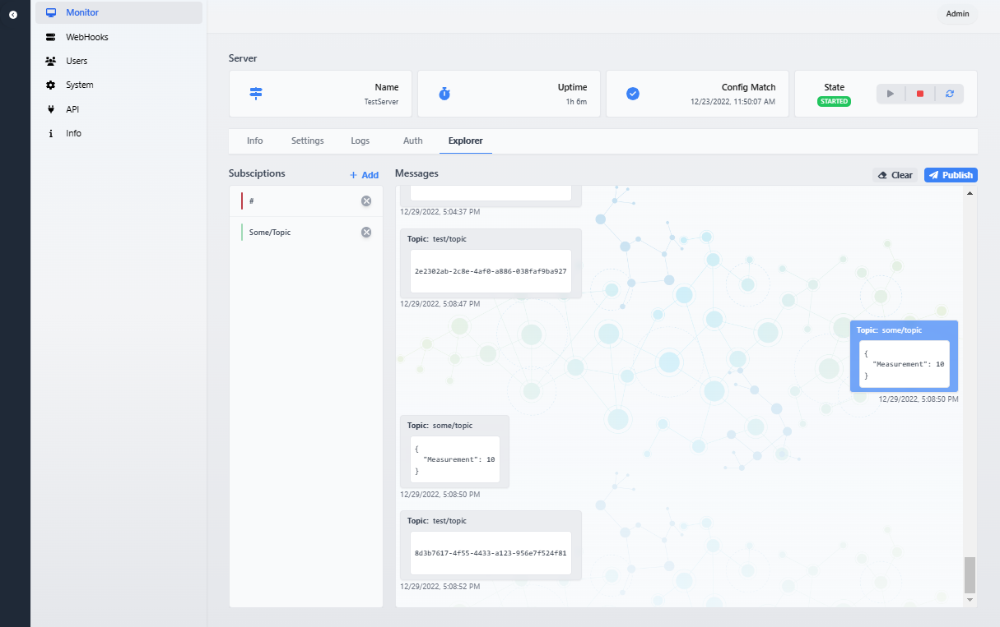
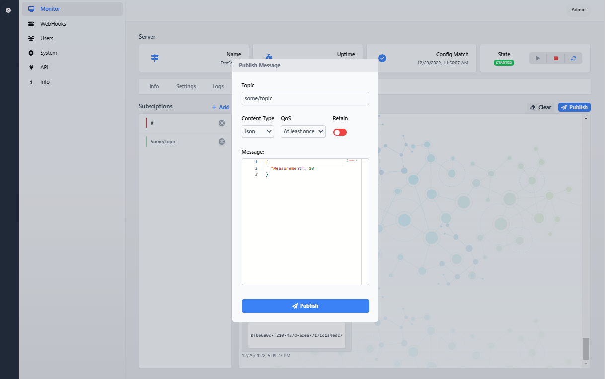
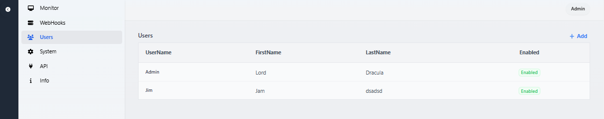
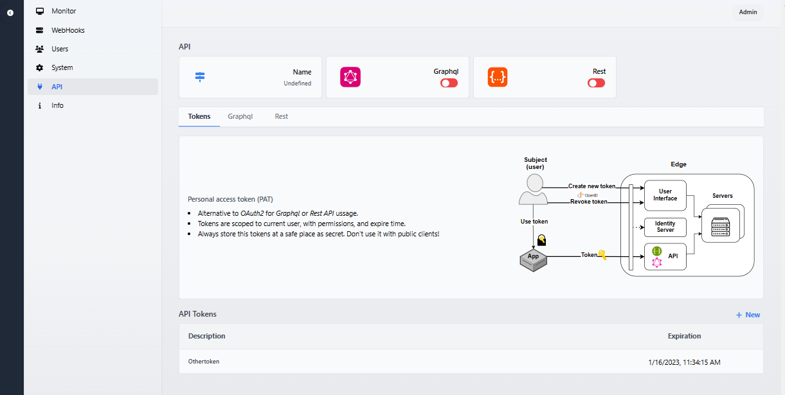
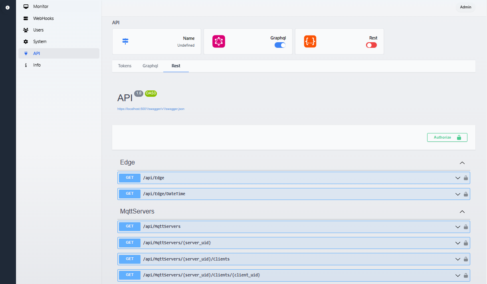
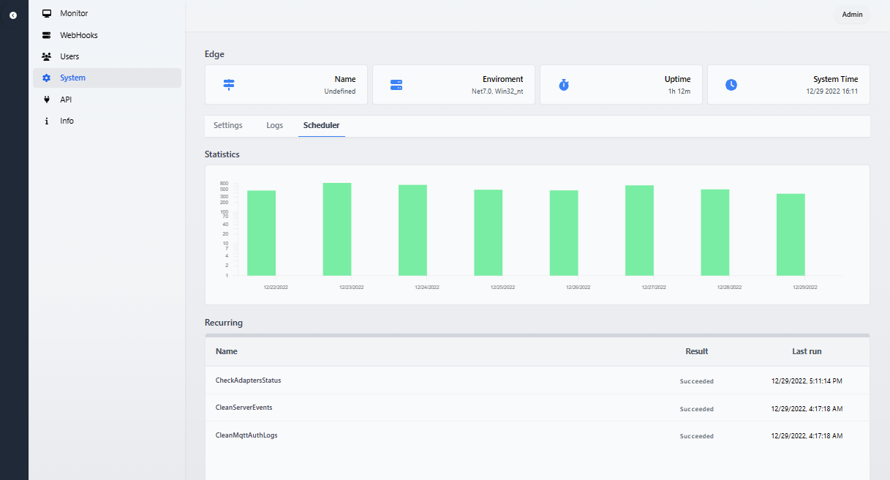
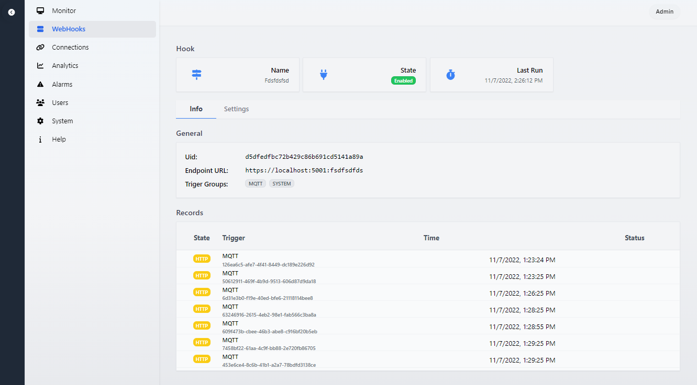

# Unified Edge

## ✨ Description

Edge Brooker provides server functionality and a future bridge between different industrial protocols. 

(Currently full functional MQTT servers).

## ⚠️ This is early BETA!
- App is in BETA and is not ready for production or ussage
- Many parts will get optimized and changed in time...

## 🧑‍💻 Local run

- Go to folder `/src/Portal/API`
- Run `dotnet watch run` from cmd

##  💾 Installers

Code is not currently signed! 

>The installers can be behind the current app.

[Win64 Installer](https://www.dropbox.com/s/73r18os0vu5tsyv/UnifiedEdge%20Setup%201.0.1.exe?dl=0)

[(Mirror) Win64 Installer](https://ulozto.cz/tamhle/6dYPMRsfZU7M#!ZJD5LmR2ZGp0AQLmMwIvMwEyLJR0Z003IIcgn1ILD2ghM2HlMN==)

## 👤 Credentials

Login: Admin

Password: Admin

## 🛣 Roadmap
 

**API**
- Graphql ✅
- Rest ✅
  
**Protocols**
- MQTT ✅
- OpcUA (InProgress)
- S7Comm
- Socket

**Environment:**
- Electron multiplatform app ✅
- Self-hosted webApp ✅
- Docker deployment

**Features:**
- Multiple servers ✅
- GraphqlToMqtt ✅
- WebHooks ✅
- Message intercepting
- Protocol bridge
- Telemetry exporter
- Grafana integration
- Backups, Config export
- Distributed operation
- External DB support

## 📺 Screenshots

    
    
    
    
    
    
    
    
          
     
    
        
         

## Author
- Dalibor Kundrat