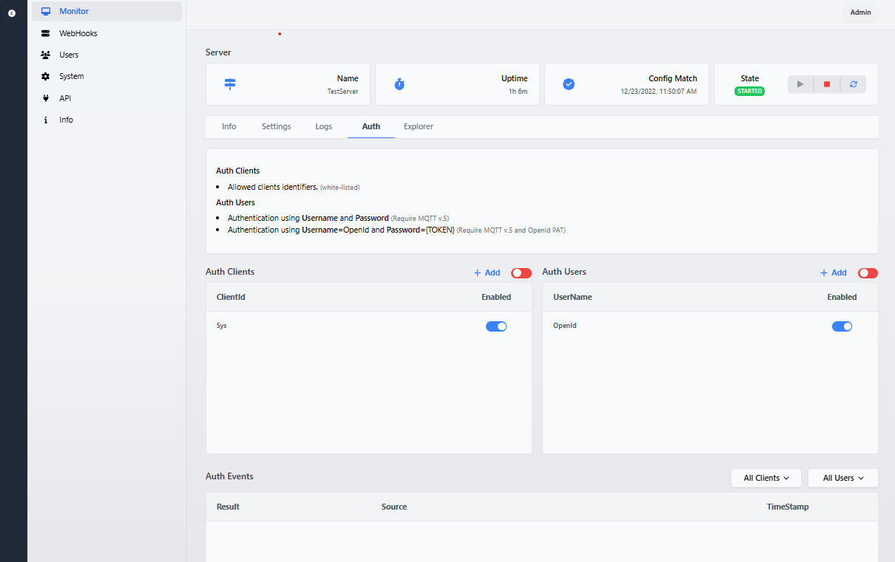

# Unified Edge


[](https://github.com/damikun/UnifiedEdge/actions/workflows/Build-Electron-Artefact.yml)
[](https://github.com/damikun/UnifiedEdge/actions/workflows/Build-Docker.yml)

## ✨ Description

UnifiedEdge provides edge functionality and a future bridge between different industrial protocols. 

(Currently full functional MQTT servers).

## ⚠️ This is early BETA!
- App is in BETA and is not ready for production or ussage
- Many parts will get optimized and changed in time...


##  💾 Installers

Code is not currently signed! 

>The installers can be behind the current app.

[Win64 Installer](https://www.dropbox.com/s/73r18os0vu5tsyv/UnifiedEdge%20Setup%201.0.1.exe?dl=0)


## 🧑‍💻 Local run

- Go to folder `/src/Portal/API`
- Run `dotnet watch run` from cmd


>App require HTTPS! Default self-signed cert location is: `./DevCerts/c.pfx"`

Default url: `https://localhost:5001/`

## 🧑‍💻 Docker

Run:

`docker-compose up` from root folder.. (Make sure you have proper cert installed...) The default path and password is defined inside compose file.. 

Default env. confinguration is:

```yaml
- ASPNETCORE_Kestrel__Certificates__Default__Path=/https/aspnetapp.pfx
```

To generate proper certs use following cmd for Windows 
Windows Example
```cli
dotnet dev-certs https --clean
dotnet dev-certs https -ep %USERPROFILE%\.aspnet\https\aspnetapp.pfx
dotnet dev-certs https --trust
```

Linux Example
```cli
dotnet dev-certs https --clean
dotnet dev-certs https -ep ${HOME}/.aspnet/https/aspnetapp.pfx
dotnet dev-certs https --trust
```


For other platforms look on [Microsoft documentation.](https://learn.microsoft.com/en-us/aspnet/core/security/docker-https?view=aspnetcore-7.0).

Make sure the paths in config match with generated certs...

Default url: `https://localhost:5001/`

## 👤 Credentials

Login: Admin

Password: Admin

## 🛣 Roadmap
</br>

**API**
- Graphql ✅
- Rest ✅
  
**Protocols**
- MQTT ✅
- OpcUA (InProgress)
- S7Comm
- Socket

**Environment:**
- Electron multiplatform app ✅
- Self-hosted webApp ✅
- Docker ✅

**Features:**
- Multiple servers ✅
- MqttToGraphql ✅
- WebHooks ✅
- Auth / OpenId ✅
- Message intercepting
- Protocol bridge
- Telemetry exporter
- Grafana integration
- Backups, Config export
- Distributed operation
- External DB support

## 📺 Screenshots

<p align="center">
    
    
    
    
    
    
    
    
          
     
    
        
         
</p>

## Author
- Dalibor Kundrat